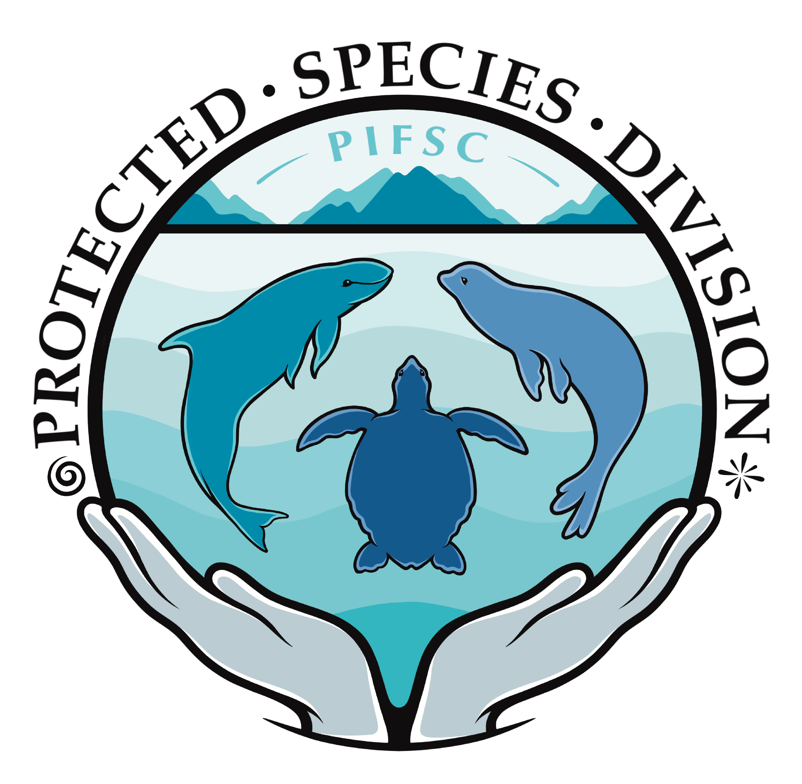

---
output:
  md_document:
    variant: gfm
---

<!-- README.md is generated from README.Rmd. Please edit that file -->

```{r, echo = FALSE}
knitr::opts_chunk$set(
  collapse = TRUE,
  comment = "#>",
  fig.path = "README-"
)
```

```{=html}
<!-- badges: start 
[](https://dsjohnson.r-universe.dev)
[](https://github.com/NMML/crawl/actions)
[](https://lifecycle.r-lib.org/articles/stages.html#stable)
 badges: end -->
```

# Density Surface Modeling: A Case Study for Central Pacific False Killer Whales (*Pseudorca crassidens*)

<p float="center">

             

</p>

Full documentation is available [here](https://pifsc-protected-species-division.github.io/density_surface_modeling/).

### License

As a work by US federal employees as part of their official duties, this project is in the public domain within the United States of America. Additionally, we waive copyright and related rights in the work worldwide through the CC0 1.0 Universal public domain dedication.

### NOAA Disclaimer

This repository is a scientific product and is not official communication of the National Oceanic and Atmospheric Administration, or the United States Department of Commerce. All NOAA GitHub project code is provided on an 'as is' basis and the user assumes responsibility for its use. Any claims against the Department of Commerce or Department of Commerce bureaus stemming from the use of this GitHub project will be governed by all applicable Federal law. Any reference to specific commercial products, processes, or services by service mark, trademark, manufacturer, or otherwise, does not constitute or imply their endorsement, recommendation or favoring by the Department of Commerce. The Department of Commerce seal and logo, or the seal and logo of a DOC bureau, shall not be used in any manner to imply endorsement of any commercial product or activity by DOC or the United States Government.
