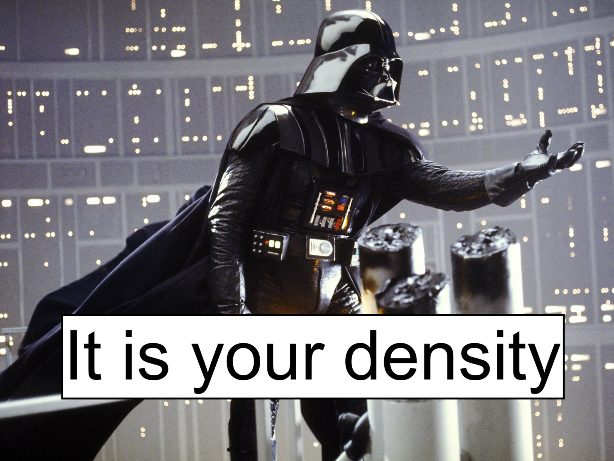

| 
| **Devin Johnson**, **Erin Oleson**, **Janelle Badger**, **Amanda Bradford**, **Jennifer McCullough**
| Pacific Islands Fisheries Science Center, NOAA Fisheries, Honolulu, Hawaiʻi
| 
| **Yvonne Barkley**
| Cooperative Institute for Marine & Atmospheric Research, University of Hawaiʻi at Mānoa, Honolulu, Hawaiʻi
| 
| **Elizabeth Becker**
| Cascadia Research Collective LLC, Olympia, Washington
| 
| **Megan Wood**
| Saltwater Inc., Anchorage, Alaska
| 
| 
| 
| 

{width="60%" fig-align="center"}

| 
| 

### Summary

Spatially-explicit density surface models (DSMs) for cetaceans have become a powerful assessment and management tool enabling examination of animal distribution and density at various scales within the modeled area. The objective of this project, with support from the [NOAA Fisheries National Protected Species Toolbox Initiative](https://www.fisheries.noaa.gov/national/population-assessments/national-protected-species-toolbox-initiative), is to update the DSM framework used to estimate cetacean abundance in the central Pacific and Hawaiʻi and produce new density estimates for pelagic false killer whales, and other species, using data through the [2023 Hawaiian Islands Cetacean and Ecosystem Assessment Survey (HICEAS)](https://www.fisheries.noaa.gov/feature-story/mission-high-seas-hawaiian-islands-cetacean-and-ecosystem-assessment-survey). This Toolbox project is using open science practices to accomplish three main objectives: (1) reformulation of the current central Pacific/Hawaiʻi DSM structure in R using upgraded spatial functionality and new modeled oceanographic products, (2) integration of new spatially-explicit methods for propagating uncertainty of detection parameters and environmental variability, and (3) exploration and integration of new model validation approaches, especially for data limited species. While the objectives of this project are to provide updated abundance estimates for pelagic false killer whales in the central Pacific region, the overall goal is to provide a current, open access workflow for density surface modeling of distance sampling-based survey data that NOAA Fisheries and other users can utilize for reproducible cetacean density estimation. Here, we provide a discussion of the workflow, products, and current status of the project.

### R code

R script files to execute the DSM analysis presented here can be found within the [Github repository for this webpage](https://github.com/PIFSC-Protected-Species-Division/density_surface_modeling/tree/master/_R_code).

The R code shown here is a consolidation and update of code developed over many years by **Elizabeth Becker**, **Karin Forney**, and **Jay Barlow** while at the NOAA Fisheries Southwest Fisheries Science Center and **Dave Miller** while at the University of St. Andrews Centre for Research into Ecological and Environmental Modelling.

### License

As a work by US federal employees as part of their official duties, this project is in the public domain within the United States of America. Additionally, we waive copyright and related rights in the work worldwide through the CC0 1.0 Universal public domain dedication.

### NOAA Disclaimer

*This repository is a scientific product and is not official communication of the National Oceanic and Atmospheric Administration, or the United States Department of Commerce. All NOAA GitHub project code is provided on an 'as is' basis and the user assumes responsibility for its use. Any claims against the Department of Commerce or Department of Commerce bureaus stemming from the use of this GitHub project will be governed by all applicable Federal law. Any reference to specific commercial products, processes, or services by service mark, trademark, manufacturer, or otherwise, does not constitute or imply their endorsement, recommendation or favoring by the Department of Commerce. The Department of Commerce seal and logo, or the seal and logo of a DOC bureau, shall not be used in any manner to imply endorsement of any commercial product or activity by DOC or the United States Government.*

| 
| 
| 
| 
| 
| 
| 
| 
| 
| 
| 

{width="50%" fig-align="center"}
